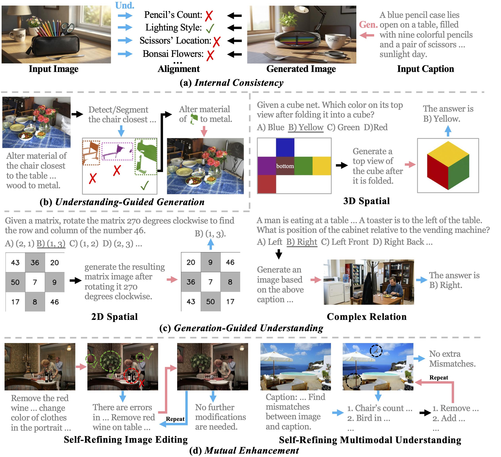

<div align="center">
<h1>: Benchmarking Unified Multimodal Models via Synergistic Understanding and Generation</h3>
</div>

<p align="center"><b><a href="https://scholar.google.com/citations?user=oPK92GMAAAAJ&hl=en&authuser=1">Jinyu Liu</a>, <a href="https://scholar.google.com/citations?user=kLY6SUMAAAAJ&hl=en&oi=ao">Xincheng Shuai</a>, <a href="https://henghuiding.com">Henghui Ding</a>, <a href="https://scholar.google.com/citations?user=f3_FP8AAAAAJ&hl=en&oi=ao">Yu-Gang Jiang</a></b></p>
<p align="center">Fudan University</p>

<div align="center">
<a href='https://arxiv.org/abs/2606.26984'></a> &nbsp;&nbsp;&nbsp;&nbsp;
<a href='https://fudancvl.github.io/Unison'></a> &nbsp;&nbsp;&nbsp;&nbsp;
<a href="https://huggingface.co/datasets/FudanCVL/Unison"></a> &nbsp;&nbsp;&nbsp;&nbsp;
<a href="https://huggingface.co/FudanCVL/Unison-Judge"></a> &nbsp;&nbsp;&nbsp;&nbsp;
</div>


***TL;DR: Unison evaluates Unified Multimodal Models (UMMs) by leveraging the synergy between understanding and generation across four dimensions. Unison-Judge, the automatic evaluation model, achieves an 88.7% alignment with human judgments.***


## 🔥 Updates
- **[2026/06/26]** [Annotations](https://huggingface.co/FudanCVL/Unison-Judge/tree/main/Judge_Consistency) about human consistency are released.
- **[2026/06/25]** [Unison-Bench](https://huggingface.co/datasets/FudanCVL/Unison) and [Unison-Judge](https://huggingface.co/FudanCVL/Unison-Judge) are released.

## 📖 Overview


<p align="center"></p>


## 📊 Evaluation Results

### Open-Source Unified Multimodal Models

<table>
  <thead>
    <tr>
      <th rowspan="2" align="left" width="140">Model</th>
      <th rowspan="2" align="left">Params</th>
      <th colspan="3">Internal Consistency</th>
      <th colspan="3">Und.-Guided Gen.</th>
      <th colspan="3">Gen-Guided Und.</th>
      <th colspan="3">Mutual Enhancement</th>
      <th rowspan="2">Overall</th>
    </tr>
    <tr>
      <th>Und.</th><th>Gen.</th><th>Uni.</th>
      <th>Und.</th><th>Gen.</th><th>Uni.</th>
      <th>Und.</th><th>Gen.</th><th>Uni.</th>
      <th>Und.</th><th>Gen.</th><th>Uni.</th>
    </tr>
  </thead>
  <tbody>
    <tr><td align="left" nowrap><a href="https://github.com/showlab/Show-o">Show-o</a></td><td align="left">1.3B</td><td align="right">88.3</td><td align="right">64.7</td><td align="right">58.5</td><td align="right">8.90</td><td align="center">-</td><td align="center">-</td><td align="right">12.0</td><td align="center">-</td><td align="center">-</td><td align="center">-</td><td align="center">-</td><td align="center">-</td><td align="center">-</td></tr>
    <tr><td align="left" nowrap><a href="https://github.com/deepseek-ai/Janus">Janus-Pro</a></td><td align="left">1.5B</td><td align="right">94.4</td><td align="right">47.1</td><td align="right">45.0</td><td align="right">0.3</td><td align="center">-</td><td align="center">-</td><td align="right">19.2</td><td align="center">-</td><td align="center">-</td><td align="center">-</td><td align="center">-</td><td align="center">-</td><td align="center">-</td></tr>
    <tr><td align="left" nowrap><a href="https://github.com/showlab/Show-o/tree/main/show-o2">Show-o2</a></td><td align="left">1.5B</td><td align="right"><u>96.0</u></td><td align="right">67.9</td><td align="right">65.8</td><td align="right">26.7</td><td align="center">-</td><td align="center">-</td><td align="right">9.4</td><td align="center">-</td><td align="center">-</td><td align="center">-</td><td align="center">-</td><td align="center">-</td><td align="center">-</td></tr>
    <tr><td align="left" nowrap><a href="https://github.com/zijieli-Jlee/Dual-Diffusion">D-DiT</a></td><td align="left">2B</td><td align="right">86.5</td><td align="right">65.0</td><td align="right">58.1</td><td align="right">0.2</td><td align="center">-</td><td align="center">-</td><td align="right">6.8</td><td align="center">-</td><td align="center">-</td><td align="center">-</td><td align="center">-</td><td align="center">-</td><td align="center">-</td></tr>
    <tr><td align="left" nowrap><a href="https://github.com/illume-unified-mllm/ILLUME_plus">ILLUME+</a></td><td align="left">3B</td><td align="right">43.4</td><td align="right">19.9</td><td align="right">10.5</td><td align="right">10.3</td><td align="right">7.7</td><td align="right">9.0</td><td align="right">11.3</td><td align="right">30.1</td><td align="right">15.1</td><td align="right">1.0</td><td align="right">5.5</td><td align="right">3.2</td><td align="center">9.4</td></tr>
    <tr><td align="left" nowrap><a href="https://github.com/deepseek-ai/Janus">Janus-Pro</a></td><td align="left">7B</td><td align="right">95.7</td><td align="right">71.7</td><td align="right">69.8</td><td align="right">3.2</td><td align="center">-</td><td align="center">-</td><td align="right">15.1</td><td align="center">-</td><td align="center">-</td><td align="center">-</td><td align="center">-</td><td align="center">-</td><td align="center">-</td></tr>
    <tr><td align="left" nowrap><a href="https://github.com/showlab/Show-o/tree/main/show-o2">Show-o2</a></td><td align="left">7B</td><td align="right"><strong>97.2</strong></td><td align="right">73.8</td><td align="right">72.5</td><td align="right">9.9</td><td align="center">-</td><td align="center">-</td><td align="right">9.2</td><td align="center">-</td><td align="center">-</td><td align="center">-</td><td align="center">-</td><td align="center">-</td><td align="center">-</td></tr>
    <tr><td align="left" nowrap><a href="https://github.com/illume-unified-mllm/ILLUME_plus">ILLUME+</a></td><td align="left">7B</td><td align="right">80.2</td><td align="right">20.4</td><td align="right">16.7</td><td align="right">12.4</td><td align="right">10.4</td><td align="right">11.4</td><td align="right">11.3</td><td align="right">27.7</td><td align="right">13.9</td><td align="right">2.7</td><td align="right">6.8</td><td align="right">4.8</td><td align="center">11.7</td></tr>
    <tr><td align="left" nowrap><a href="https://github.com/VectorSpaceLab/OmniGen2">OmniGen2</a> 🥈</td><td align="left">7B</td><td align="right">92.3</td><td align="right"><u>79.0</u></td><td align="right"><u>74.5</u></td><td align="right"><u>61.3</u></td><td align="right"><u>42.6</u></td><td align="right"><u>52.0</u></td><td align="right">19.7</td><td align="right"><strong>41.9</strong></td><td align="right"><u>30.9</u></td><td align="right"><u>45.0</u></td><td align="right"><u>50.3</u></td><td align="right"><strong>47.7</strong></td><td align="center"><u>51.3</u></td></tr>
    <tr><td align="left" nowrap><a href="https://github.com/ByteVisionLab/TokenFlow">TokenFlow</a></td><td align="left">14B</td><td align="right">93.0</td><td align="right">47.1</td><td align="right">44.5</td><td align="right">20.1</td><td align="center">-</td><td align="center">-</td><td align="right">17.0</td><td align="center">-</td><td align="center">-</td><td align="center">-</td><td align="center">-</td><td align="center">-</td><td align="center">-</td></tr>
    <tr><td align="left" nowrap><a href="https://github.com/ByteDance-Seed/Bagel">BAGEL</a> 🥇</td><td align="left">14B</td><td align="right"><u>96.0</u></td><td align="right"><strong>82.5</strong></td><td align="right"><strong>80.3</strong></td><td align="right">57.6</td><td align="right"><strong>78.1</strong></td><td align="right"><strong>67.9</strong></td><td align="right"><strong>28.2</strong></td><td align="right"><u>41.6</u></td><td align="right"><strong>32.0</strong></td><td align="right">7.2</td><td align="right"><strong>57.7</strong></td><td align="right"><u>32.5</u></td><td align="center"><strong>53.2</strong></td></tr>
    <tr><td align="left" nowrap><a href="https://github.com/AILab-CVC/SEED-X">SEED-X</a></td><td align="left">17B</td><td align="right">82.8</td><td align="right">38.9</td><td align="right">34.2</td><td align="right">18.6</td><td align="right">13.7</td><td align="right">16.1</td><td align="right">13.5</td><td align="right">27.4</td><td align="right">20.8</td><td align="right">0.2</td><td align="right">16.8</td><td align="right">8.5</td><td align="center">19.9</td></tr>
    <tr><td align="left" nowrap><a href="https://github.com/PKU-YuanGroup/UniWorld">UniWorld-V1</a> 🥉</td><td align="left">19B</td><td align="right">92.6</td><td align="right">68.5</td><td align="right">65.1</td><td align="right"><strong>63.4</strong></td><td align="right">26.4</td><td align="right">44.9</td><td align="right"><u>22.8</u></td><td align="right">32.0</td><td align="right">26.9</td><td align="right"><strong>46.4</strong></td><td align="right">16.2</td><td align="right">31.3</td><td align="center">42.1</td></tr>
  </tbody>
</table>

### Closed-Source Models

<table>
  <thead>
    <tr>
      <th rowspan="2" align="left" width="140">Model</th>
      <th rowspan="2" align="left">Params</th>
      <th colspan="3">Internal Consistency</th>
      <th colspan="3">Und.-Guided Gen.</th>
      <th colspan="3">Gen-Guided Und.</th>
      <th colspan="3">Mutual Enhancement</th>
      <th rowspan="2">Overall</th>
    </tr>
    <tr>
      <th>Und.</th><th>Gen.</th><th>Uni.</th>
      <th>Und.</th><th>Gen.</th><th>Uni.</th>
      <th>Und.</th><th>Gen.</th><th>Uni.</th>
      <th>Und.</th><th>Gen.</th><th>Uni.</th>
    </tr>
  </thead>
  <tbody>
    <tr><td align="left" nowrap>Gemini 3 Pro</td><td align="center">-</td><td align="right">98.3</td><td align="right">88.1</td><td align="right">86.9</td><td align="right">71.0</td><td align="right">82.8</td><td align="right">76.9</td><td align="right">42.2</td><td align="right">46.5</td><td align="right">43.9</td><td align="right">65.3</td><td align="right">77.4</td><td align="right">71.4</td><td align="center">69.8</td></tr>
    <tr><td align="left" nowrap>GPT-5.2</td><td align="center">-</td><td align="right">98.6</td><td align="right">86.3</td><td align="right">84.7</td><td align="right">69.7</td><td align="right">85.7</td><td align="right">77.7</td><td align="right">44.8</td><td align="right">58.2</td><td align="right">52.7</td><td align="right">69.1</td><td align="right">71.2</td><td align="right">70.2</td><td align="center">71.3</td></tr>
  </tbody>
</table>


## 📦 Data Preparation

Download [Unison-Bench](https://huggingface.co/datasets/FudanCVL/Unison) from HuggingFace into `data/` at the repo root:

```bash
huggingface-cli download FudanCVL/Unison \
    --repo-type dataset --local-dir data/
```

The expected layout:

```
Unison/
└── data/
    ├── Internal_Consistency/
    ├── Und_Guided_Gen/
    ├── Gen_Guided_Und/
    └── Mutual_Enhancement/
```

Both launch scripts default to `DATA_DIR=../data`, so no extra flags are needed. To use a different path, pass `--data-dir /path/to/data` or set `DATA_DIR`.


## 🛠️ Installation

### Step 1 — Base environment

```bash
cd Inference_Pipeline
UMM=/data/Unified_Models ./setup_envs.sh base
```

Creates the `unison` conda env from the root `requirements.txt`. This env covers both the inference and the evaluation pipeline.

### Step 2 — Per-model environments

```bash
# All models at once
UMM=/data/Unified_Models ./setup_envs.sh

# Or selected models
UMM=/data/Unified_Models ./setup_envs.sh bagel omnigen2
```

| Group | conda env | Upstream repo |
|-------|-----------|---------------|
| `bagel`     | `bagel`     | `ByteDance-Seed/Bagel` |
| `janus`     | `janus`     | `deepseek-ai/Janus` |
| `omnigen2`  | `omnigen2`  | `VectorSpaceLab/OmniGen2` |
| `seedx`     | `seedx`     | `AILab-CVC/SEED-X` |
| `showo`     | `showo2`    | `showlab/Show-o` |
| `tokenflow` | `tokenflow` | `ByteVisionLab/TokenFlow` |
| `uniworld`  | `univa`     | `PKU-YuanGroup/UniWorld` |
| `illume`    | `illume`    | `illume-unified-mllm/ILLUME_plus` |
| `ddit`      | `d-dit`     | `zijieli-Jlee/Dual-Diffusion` |

Each group clones its upstream repo into `$UMM/<Repo>` and installs it into the corresponding conda env. The script is idempotent; logs go to `setup_logs/`.


## 🤗 Model Weights

### Benchmark model weights

Model configs in `Inference_Pipeline/config/*.json` reference local weight paths using the placeholder root `/path/to/Unified_Models/...`. Edit each config to point at your local checkout, e.g.:

```json
{
  "model_name": "UniWorld-V1",
  "model_path": "/path/to/Unified_Models/UniWorld/UniWorld-V1/model_weights/UniWorld-V1",
  "api_type": "uniworld",
  "conda_env": "univa",
  "capabilities": ["understanding", "generation", "editing"]
}
```

`download_weights.sh` fetches weights for all model backends. Set the local weight root and pick models:

```bash
UMM=/data/Unified_Models ./download_weights.sh                 # everything
UMM=/data/Unified_Models ./download_weights.sh bagel showo1    # selected groups
```

Gated repos (FLUX.1-dev, SD3) need `huggingface-cli login` + license acceptance. Run `setup_envs.sh` and `download_weights.sh` with the same `UMM` so code and weights share one root.

### Unison-Judge

The default evaluation backend runs [**Unison-Judge**](https://huggingface.co/FudanCVL/Unison-Judge).

**Where to put it:** download the checkpoint into `Evaluation_Pipeline/unison-judge/`. That is the default path used by `evaluate_unison.py` and `run_evaluate_unison.sh`, so no flags are needed:

```
Unison/
└── Evaluation_Pipeline/
    └── unison-judge/            # <- put Unison-Judge weights here
        ├── config.json
        ├── model-*.safetensors
        └── ...
```

To keep it elsewhere, set `LOCAL_JUDGE_MODEL=/path/to/judge` or pass `--local-model-path /path/to/judge`. No local judge weights are needed when using the `api` backend.


## 🚀 Inference

```bash
cd Inference_Pipeline

# Run all tasks on one model
GPUS=0,1,2,3,4,5,6,7 MODELS=BAGEL-7B-MoT TASKS=IC,UGG,GGU,ME ./run.sh

# Select tasks or test with 2 items
GPUS=0,1,2,3 MODELS=UniWorld-V1 TASKS=IC,GGU ./run.sh
GPUS=0 MODELS=Janus-Pro-7B TEST_MODE=true ./run.sh
```

Results are written to `result/<ModelName>/<TaskID>/<TaskID>_<ModelName>_results.csv`.

## 📐 Evaluation

```bash
cd Evaluation_Pipeline

# Local judge (default) — uses Unison-Judge weights
GPU_IDS=0,1,2,3 MODELS=BAGEL-7B-MoT ./run_evaluate_unison.sh

# Select tasks or evaluate several models at once
MODELS=BAGEL-7B-MoT TASKS=IC,GGU ./run_evaluate_unison.sh
MODELS="BAGEL-7B-MoT,UniWorld-V1" GPU_IDS=0,1,2,3,4,5,6,7 ./run_evaluate_unison.sh

# Closed-source model API judge
JUDGE_BACKEND=api OPENAI_API_KEY=sk-... MODELS=UniWorld-V1 ./run_evaluate_unison.sh

# Aggregate results across models
python aggregate_results.py   # -> evaluation_summary.json
```

Output per model: `eval_<ModelName>.json`.

## 🙏 Acknowledgement

We sincerely thank the open-source community for their outstanding contributions. Unison-Judge is built upon [Qwen3-VL](https://github.com/QwenLM/Qwen2.5-VL). The evaluated models, including [BAGEL](https://github.com/ByteDance-Seed/Bagel), [UniWorld](https://github.com/PKU-YuanGroup/UniWorld), [OmniGen2](https://github.com/VectorSpaceLab/OmniGen2), [Show-o](https://github.com/showlab/Show-o), [Janus-Pro](https://github.com/deepseek-ai/Janus), [SEED-X](https://github.com/AILab-CVC/SEED-X), [TokenFlow](https://github.com/ByteVisionLab/TokenFlow), [ILLUME+](https://github.com/illume-unified-mllm/ILLUME_plus), and [D-DiT](https://github.com/zijieli-Jlee/Dual-Diffusion) et al., form the foundation of this benchmark. We are grateful to all the authors for making their work publicly available.

## 📝 Citation

If you find this work useful, please cite:

```bibtex
@inproceedings{liu2026unison,
  title     = {{Unison}: Benchmarking Unified Multimodal Models via Synergistic Understanding and Generation},
  author    = {Liu, Jinyu and Shuai, Xincheng and Ding, Henghui and Jiang, Yu-Gang},
  booktitle = {International Conference on Machine Learning},
  year      = {2026}
}
```

## 📬 Contact

If you have any questions, feel free to contact us at [liujy24@m.fudan.edu.cn](mailto:liujy24@m.fudan.edu.cn).
